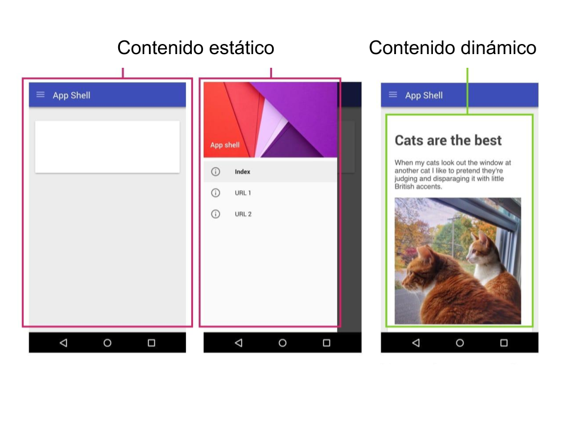
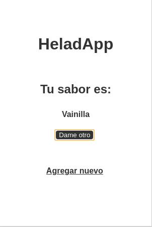
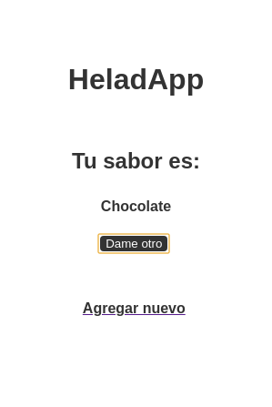
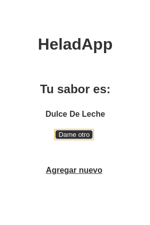

# Tomemos un helado con NodeJS

---

## Sebastián Alvarez
## Pergamino, Provincia de Buenos Aires
## Workast

---

# Veamos una típica app (móvil, webapp, etc)

---

---

# ¿Contenido dinámico?

---

## Ejemplos de contenido dinámico:

 - Posts
 - Tweets
 - Noticias

---

## ¿Quién le da a una página web este contenido dinámico?
### ¿Quién se lo sirve?

---

# Un servicio web

---

# Vamos con un ejemplo
## Sitio de noticias

---

## Sitio de noticias
### Contenido estático
 - Título
 - Logo
 - Colores de fondo

---

## Sitio de noticias
### Contenido dinámico
 - Las noticias
 - Fotos
 - Videos

---

#### ¿Qué pasa cuando entramos al sitio de noticias?

1. www.sitio.de.noticias.com
2. Contenido estático
3. Contenido dinámico
4. 
5. Sitio listo para usar

---

## ¿Qué pasaría sin un servicio web?

 - Siempre veríamos las mismas noticias
 - Vería noticias que no me interesan
 - Necesito darle al F5 para tener nuevas noticias

---

# Vamos con otro ejemplo
## HeladApp

---

### ¿Cuál es el contenido estático?, ¿y el dinámico?

---

# Suficiente con ésto de estático y dinámico

---

# ¿Qué vamos a hacer en este taller?

---

### Vamos a armar el servicio web que "alimenta" nuestra **HeladApp** con sabores aleatorios de helado
##### (De yapa vamos a permitir que se puedan agregar más sabores)

---

# Ingredientes

 - NodeJS
 - Editor de código
 - Postman
 - Navegador web

---

# Armemos nuestro primer webserver
## Servidor que saluda

---

# Ahora armemos uno que tenga que ver con helados
## Servidor que devuelve sabores si accesamos una URL

---

# Pausa

---

### Usando diferentes urls podemos hacer que nuestro servicio devuelva diferentes respuestas
### Si bien es tentador
### ...
## Vamos a tener un desorden importante en poco tiempo
###

---

## Hay solución para el desorden:
# Rest

---

# Rest
 - Organizar
 - Acceder
 - URLs como ubicación de recursos

---

# ¿Cómo usamos Rest para nuestro servicio web?

---

## URLs (o también llamados Endpoints)

#### /dameTodos -> /helados
#### /dameAleatorio -> /helados/aleatorio

---

# Bonus track

---

## Hasta hora solo trajimos información
## ¿Qué hay de agregar?

---

# Verbos HTTP
 - GET (traer información)
 - POST (subir información)

---

## ¿Cómo quedan nuestros endpoints?

#### /helados (GET)
#### /helados/aleatorio (GET)
#### /helados (POST)

---

## /helados (GET) 
## /helados (POST)

---

## Desde la perspectiva del servicio
 - GET (devuelve información)
 - POST (recibe información)

---

# Bien, ¿y ahora?

---

# Mejoras

- ¿Cómo evito que suban un sabor repetido?
- ¿Cómo elimino un sabor?
- ¿Qué otras cosas se pueden mejorar?

---

# Gracias
